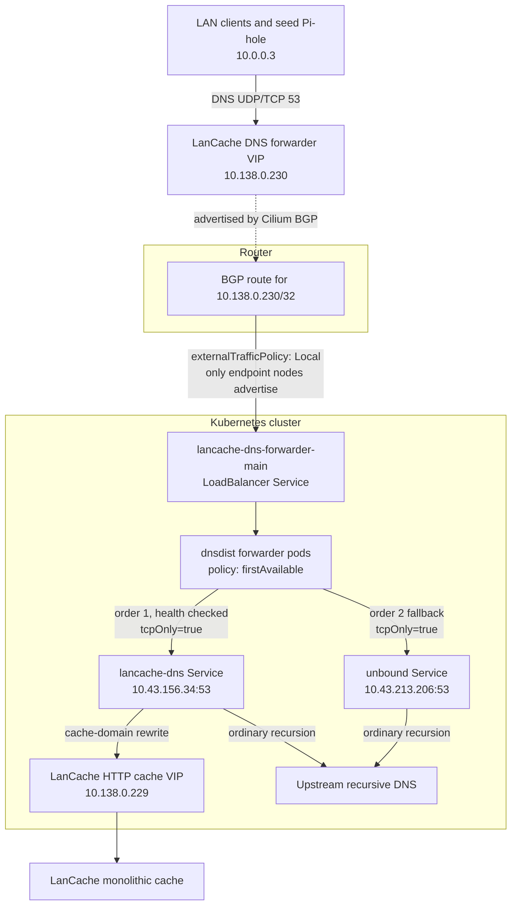

# LanCache DNS failover

LanCache uses a DNS forwarder in front of `lancache-dns` so game clients can keep resolving download domains even when the cache DNS sidecar is unavailable. The goal is to prefer cached game download rewrites when LanCache is healthy, but fall back to normal recursive DNS instead of leaving clients with timed-out DNS queries.



## Runtime behavior

The forwarder is configured in `apps/lancache-dns-forwarder/values.yaml` with two downstream DNS servers:

- `lancache-dns`, `order=1`: preferred while healthy
- `unbound-fallback`, `order=2`: used when `lancache-dns` is marked unhealthy

`dnsdist` uses `setServerPolicy(firstAvailable)`, so it chooses the first available backend by order. Health checks run continuously; if the LanCache DNS backend stops responding, `dnsdist` marks it down and sends new DNS requests to Unbound. When LanCache DNS recovers and passes health checks again, it becomes the preferred backend again.

The forwarder Service uses `externalTrafficPolicy: Local`. That keeps BGP advertisements limited to nodes running ready forwarder pods, which avoids advertising the VIP from every node and preserves the source client address as far as the forwarder path allows.

## Expected query outcomes

When LanCache DNS is healthy:

```text
dig lancache.steamcontent.com @10.138.0.230
```

returns a LanCache rewrite such as:

```text
lancache.steamcontent.com. CNAME steam.cache.lancache.net.
steam.cache.lancache.net. A 10.138.0.229
```

Ordinary domains also resolve through the same VIP:

```text
dig yahoo.com @10.138.0.230
```

If LanCache DNS is down, cache-domain rewrites stop being applied and clients receive normal recursive DNS answers from Unbound instead of timing out.

## Useful checks

Inspect the generated `dnsdist` configuration:

```bash
kubectl exec -n lancache-dns-forwarder deploy/lancache-dns-forwarder -c main -- \
  cat /config-out/dnsdist.conf
```

Check backend health and query counters:

```bash
kubectl run dnsdist-metrics-check \
  --rm -i \
  --restart=Never \
  --image=ghcr.io/nicolaka/netshoot:latest \
  -n lancache-dns-forwarder -- \
  sh -c "curl -fsS http://lancache-dns-forwarder-webserver:8083/metrics | grep -E 'dnsdist_server_(status|queries|responses|drops|order|healthcheckfailures)'"
```

Validate the live VIP:

```bash
dig lancache.steamcontent.com @10.138.0.230
dig yahoo.com @10.138.0.230
```
